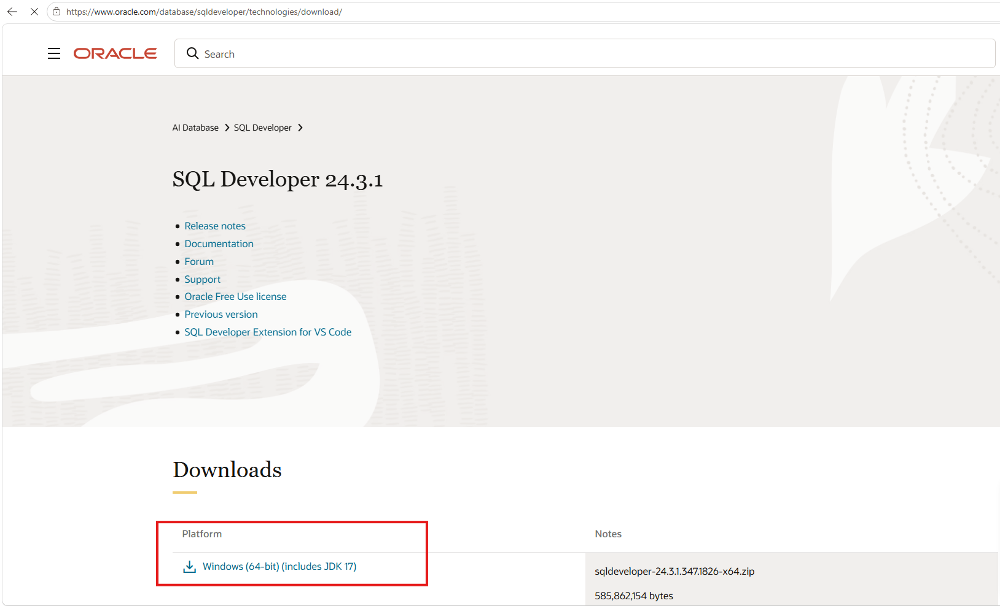
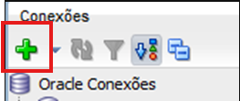
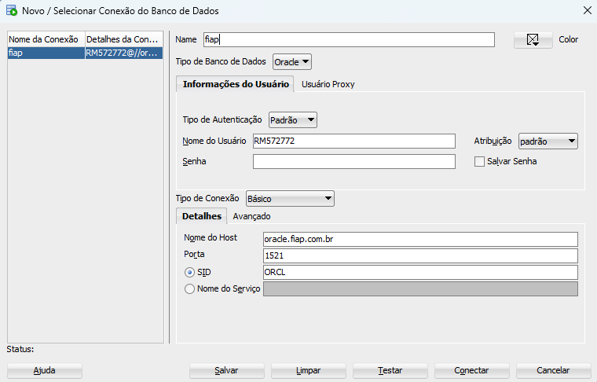
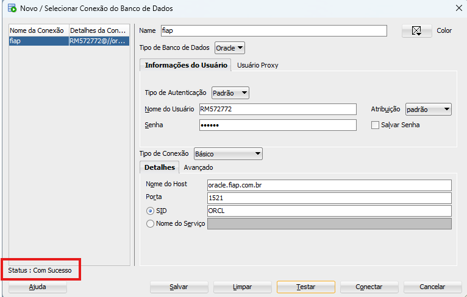
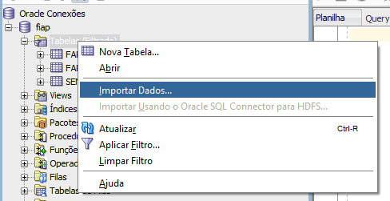
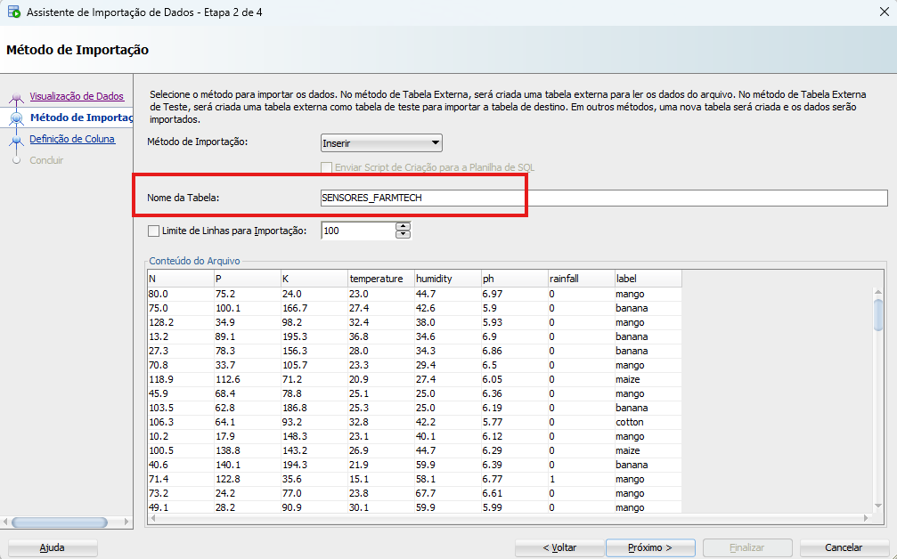
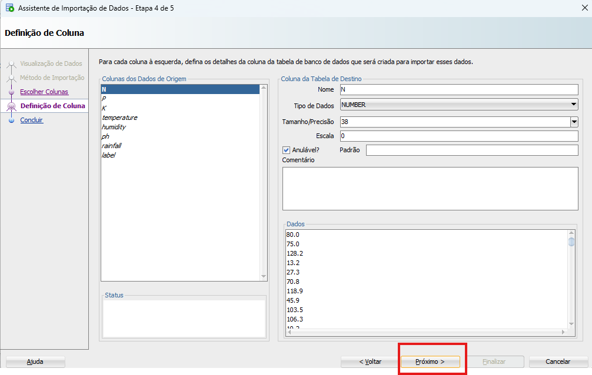
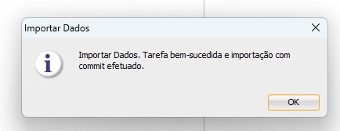
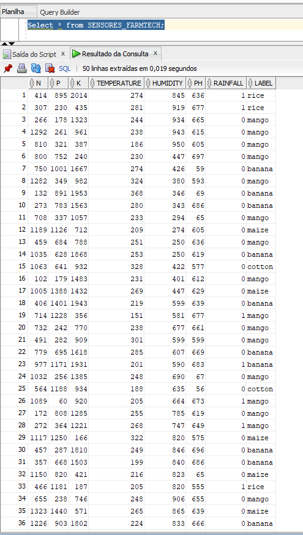

> # 🌱 FarmTech Solutions — Sistema de Irrigação Inteligente


## 👥 Integrantes

| Nome           |
| -------------- |
| Thiese Novaes  |
| João Vitor     |
| Talles Duran   |
| Kevin Santiago |
| Renan de Souza |

---

## 📋 Descrição do Projeto

Este projeto foi desenvolvido como parte das **Fases 2, 3 e 4** do curso de Inteligência Artificial da FIAP,
pela startup fictícia **FarmTech Solutions**.

O objetivo é simular um sistema de irrigação inteligente para uma lavoura de **café**,
utilizando um microcontrolador **ESP32** simulado na plataforma **Wokwi.com**,
com sensores que monitoram as condições do solo em tempo real e integração com
dados climáticos via **API OpenWeather**.

Na **Fase 3**, os dados coletados pelos sensores foram importados em um **banco de dados Oracle**
e visualizados em um **dashboard interativo** desenvolvido com Python e Streamlit.

Na **Fase 4**, o projeto evoluiu para um **Assistente Agrícola Inteligente**, incorporando modelos de
aprendizado supervisionado por regressão (Scikit-Learn) para prever variáveis críticas do campo como
umidade do solo, pH e rendimento estimado, com recomendações automáticas de irrigação e manejo.

---

## ☕ Cultura Agrícola — Café

O café foi escolhido por ser uma das culturas mais importantes do Brasil.
Suas necessidades ideais são:

| Parâmetro       | Valor Ideal | Valor Simulado         |
| --------------- | ----------- | ---------------------- |
| pH do solo      | 6,0 a 6,5   | 5,5 a 7,0 (via LDR)    |
| Umidade do solo | 60% a 80%   | DHT22                  |
| Nitrogênio (N)  | ≥ 80 mg/kg  | Simulado numericamente |
| Fósforo (P)     | ≥ 30 mg/kg  | Simulado numericamente |
| Potássio (K)    | ≥ 100 mg/kg | Simulado numericamente |

---

## 🔧 Componentes Utilizados

| Componente          | Função Real             | Função no Projeto         |
| ------------------- | ----------------------- | ------------------------- |
| ESP32 DevKit        | Microcontrolador        | Cérebro do sistema        |
| 3 Botões Verdes     | Sensores NPK            | Simula níveis de N, P e K |
| LDR + Resistor 10kΩ | Sensor de luz           | Simula o pH do solo       |
| DHT22               | Sensor de umidade do ar | Simula umidade do solo    |
| Módulo Relé         | Atuador                 | Simula a bomba d'água     |

---

## 🔌 Pinagem do Circuito

| Componente           | Pino ESP32 |
| -------------------- | ---------- |
| Botão Nitrogênio (N) | GPIO 12    |
| Botão Fósforo (P)    | GPIO 13    |
| Botão Potássio (K)   | GPIO 14    |
| LDR (pH)             | GPIO 35    |
| DHT22 (Umidade)      | GPIO 15    |
| Relé (Bomba)         | GPIO 26    |

---

## 🖼️ Circuito no Wokwi


---

## 🧠 Lógica de Irrigação

A bomba d'água (relé) é **LIGADA** quando todas as condições abaixo são satisfeitas simultaneamente:

```
✅ Nitrogênio ≥ 80 mg/kg
✅ Fósforo ≥ 30 mg/kg
✅ Potássio ≥ 100 mg/kg
✅ pH entre 5,5 e 7,0 (LDR na faixa correta)
✅ Umidade do solo abaixo de 60% (solo seco)
✅ Sem previsão de chuva (dado recebido do Python)
```

> ⚠️ **Correção aplicada na Fase 3:** O Fósforo foi incluído na lógica de decisão da bomba,
> corrigindo o apontamento do professor onde apenas N e K eram verificados (`npkOk = estadoN && estadoK`).
> A versão correta é `npkOk = estadoN && estadoP && estadoK`.

A bomba é **DESLIGADA** quando qualquer condição abaixo for verdadeira:

```
❌ Umidade acima de 80% (solo encharcado)
❌ pH fora da faixa ideal
❌ N, P ou K abaixo do mínimo necessário
❌ Previsão de chuva detectada pelo Python (valor 1 no Serial Monitor)
```

### 🔘 Funcionamento dos botões NPK:

- **1º clique** → Nutriente **presente** ✅
- **2º clique** → Nutriente **ausente** ❌

---

## 🌦️ Integração Python + OpenWeather

O arquivo `clima.py` consome a API pública da **OpenWeather** para verificar
se há previsão de chuva na cidade configurada.

### Fluxo completo:

```
🐍 Python roda clima.py
        ↓
☁️ Resultado: tem chuva ou não?
        ↓
⌨️ Usuário digita 0 ou 1 no Serial Monitor do Wokwi
        ↓
🔌 ESP32 lê o valor e decide ligar ou não a bomba
```

### Valores aceitos pelo Serial Monitor:

| Valor | Significado    | Ação                  |
| ----- | -------------- | --------------------- |
| `0`   | Sem chuva      | Irrigação liberada ✅ |
| `1`   | Chuva prevista | Irrigação suspensa 🌧️ |

### Exemplo de resultado do clima.py:

```
====================================
 FarmTech Solutions - Café
 Análise Climática para Irrigação
====================================
 Cidade      : São Paulo
 Temperatura : 19.03°C
 Umidade     : 87%
 Condição    : algumas nuvens
------------------------------------
 🌥️  Alta umidade no ar
 ⚠️  Irrigação REDUZIDA
====================================
 Resultado salvo em 'resultado_clima.txt'
 Valor: 0 (1 = tem chuva, 0 = sem chuva)
```

### Como rodar:

```bash
pip install requests
python clima.py
```

---

## 🗄️ Fase 3 — Banco de Dados Oracle

Realizamos a instalação do Oracle SQL Developer(windows), através do link
https://www.oracle.com/database/sqldeveloper/technologies/download/.


Após a instalação, descompactamos o arquivo e executamos o programa SQLDEVELOPER.


Ao abrir o programa, clicamos no icone "+" (Nova conexão) em verde.


Estabelecemos uma conexão com o banco de dados Oracle:

| Campo   | Valor                       |
| ------- | --------------------------- |
| Host    | oracle.fiap.com.br          |
| Porta   | 1521                        |
| SID     | ORCL                        |
| Usuário | RM + número (ex: RM12345)   |
| Senha   | Data de nascimento (DDMMYY) |



Depois, testamos a conexão para garantir sucesso.


Assim que conectado, clicamos no campo "Tabelas (Filtrado)", e selecionamos o campo
"Importar Dados"


Importamos os dados coletados da Fase 2, clicando em "Procurar..."


Clicamos em "Próximo", e editamos o nome da nossa tabela para "SENSORES_FARMTECH" no campo "Nome da Tabela", garantindo que não possua espaços, nem caracteres especiais ou mais que 30 caracteres.


Novamente clicamos em "Próximo", e importamos todos os dados coletados no arquivo csv, selecionando "Próximo" mais uma vez.


Após, temos a opção de alterar o nome das colunas e seu tipo de dado.
Clicamos novamente em "Próximo"


Por fim, clique em "próximo", e depois "finalizar" e aparecerá uma mensagem informando que a tarefa foi bem-sucedida.


Realizamos a consulta SQL na tabela importada;


A consulta foi realizada com sucesso, permitindo validar que os dados da Fase 2 foram importados corretamente para o banco Oracle.

## 📊 Fase 3 — Dashboard Interativo

Dashboard desenvolvido em **Python + Streamlit** para visualização dos dados dos sensores.

### Como executar:

```bash
pip install streamlit plotly pandas
python -m streamlit run dashboard.py
```

> ⚠️ Deve rodar o script dentro da pasta do arquivo.

### Funcionalidades:

| Seção                   | Descrição                                                            |
| ----------------------- | -------------------------------------------------------------------- |
| 📡 Leitura Mais Recente | Cards com umidade, pH, N, P, K e chuva                               |
| 🚿 Status da Irrigação  | Bomba ligada/desligada + sugestões automáticas                       |
| 📆 Visão Semanal        | Médias de todas as variáveis + ativações da bomba por semana (S1–S4) |
| 💧 Umidade & pH         | Série temporal com faixas ideais                                     |
| 🌿 NPK                  | Evolução de N, P, K com limiares mínimos                             |
| 🚿 Irrigação            | Barras por dia + distribuição de estados                             |
| 📊 Correlações          | Scatter plot interativo entre variáveis                              |

> Print do dashboard:

![Dashboard]
)


## 🤖 Fase 4 — Machine Learning para Predição de Culturas Agrícolas

Como extensão da solução FarmTech Solutions, foi desenvolvido um módulo de **Machine Learning supervisionado**
capaz de prever a cultura agrícola mais adequada com base em características do solo e condições climáticas.

O objetivo foi aplicar técnicas de Inteligência Artificial para auxiliar na tomada de decisão agronômica,
simulando um sistema inteligente de recomendação agrícola.

---

### 🎯 Objetivo

Dado um conjunto de atributos ambientais e químicos do solo:

- Nitrogênio (**N**)
- Fósforo (**P**)
- Potássio (**K**)
- Temperatura
- Umidade
- pH
- Índice de chuva

o modelo prevê a cultura agrícola mais compatível, como:

```text
rice
banana
maize
cotton
mango
```

### Pipeline de Tratamento dos Dados

Foi implementado um pipeline completo de preparação dos dados:

✅ carregamento do dataset <br>
✅ normalização dos tipos numéricos <br>
✅ padronização textual dos labels <br>
✅ tratamento de valores nulos usando mediana <br>
✅ remoção de duplicidades <br>
✅ aplicação de regras de validação agronômica <br>

### Análise Exploratória (EDA)

Foram geradas análises exploratórias para compreender o comportamento dos dados:

. distribuição das culturas <br>
. histograma de temperatura <br>
. histograma de pH <br>
. scatter plot de umidade vs chuva <br>
. mapa de correlação entre variáveis <br>
. boxplot comparativo de pH por cultura <br>

Além disso, foi realizado estudo de perfil médio para culturas como:

Rice
Banana
Maize

permitindo identificar padrões ideais de cultivo.

Por que escolhi eses: Para se ter melhor ideia de predições e análises, assim, comigo adotando mais plantios, poderia ter uma visão sobre o funcionamento do modelo sobre os insumos.

### Modelos de Machine Learning Utilizados

Foram treinados e comparados 5 algoritmos supervisionados:
| Modelo | Finalidade |
| ------------------- | ---------------------------- |
| Logistic Regression | baseline estatístico |
| Random Forest | ensemble robusto |
| Decision Tree | árvore interpretável |
| SVM | separação por hiperplano |
| KNN | classificação por vizinhança |

### Pipeline de Treinamento

```text
Dataset
   ↓
Pré-processamento
   ↓
Separação X / y
   ↓
Train/Test Split (80/20)
   ↓
StandardScaler (quando necessário)
   ↓
Treinamento dos modelos
   ↓
Predição
   ↓
Avaliação comparativa
```

Configuração:

        - treino: 80%
        - teste: 20%
        - random_state: 42
        - estratificação das classes

Métricas Utilizadas

Cada modelo foi avaliado com:

        - Accuracy
        - Classification Report
        - Precision
        - Recall
        - F1-score
        - Confusion Matrix

### 🏆 Comparação Final dos Modelos

Após o treinamento e avaliação dos modelos supervisionados, foi obtido o seguinte desempenho:

| Modelo              | Accuracy |
| ------------------- | -------- |
| Random Forest       | 90.00%   |
| Decision Tree       | 90.00%   |
| Logistic Regression | 77.50%   |
| SVM                 | 77.50%   |
| KNN                 | 67.50%   |

---

### 📌 Análise dos Resultados

Os melhores desempenhos foram obtidos pelos algoritmos **Random Forest** e **Decision Tree**, ambos com **90% de acurácia**.

Esse resultado indica que o problema possua padrões de decisão mais compatíveis com algoritmos baseados em árvores, capazes de capturar relações não lineares entre nutrientes do solo, temperatura, umidade e índice de chuva.

A **Logistic Regression** e o **SVM** apresentaram desempenho intermediário (**77,5%**), sugerindo que modelos mais lineares ou dependentes de separação geométrica simples não conseguiram representar tão bem a complexidade dos dados agrícolas.

O **KNN** apresentou o menor desempenho (**67,5%**), possivelmente devido à sensibilidade à escala dos dados e à sobreposição entre classes agrícolas.

---

### ✅ Conclusão

Considerando desempenho, robustez e capacidade de generalização, o modelo **Random Forest** foi considerado a melhor escolha para este projeto.

Esse algoritmo demonstra maior potencial para aplicação em sistemas inteligentes de apoio à decisão agrícola, permitindo recomendar culturas com maior confiabilidade a partir das características ambientais e químicas do solo.

Regras aplicadas:

| Validação   | Regra          |
| ----------- | -------------- |
| Nitrogênio  | ≥ 0            |
| Fósforo     | ≥ 0            |
| Potássio    | ≥ 0            |
| Temperatura | entre 0 e 60°C |
| Umidade     | entre 0 e 100% |
| pH          | entre 0 e 14   |
| Chuva       | ≥ 0            |

---

## 🗂️ Sobre os Dados — `sensores_farmtech_v2.csv`

Base com **200 registros simulados** ao longo de janeiro de 2025:

| Coluna       | Descrição               | Faixa     |
| ------------ | ----------------------- | --------- |
| `timestamp`  | Data e hora da leitura  | Jan/2025  |
| `umidade`    | Umidade do solo (%)     | 25 – 95%  |
| `ph`         | pH do solo              | 5,5 – 7,0 |
| `nitrogenio` | Nitrogênio (mg/kg)      | 10 – 140  |
| `fosforo`    | Fósforo (mg/kg)         | 5 – 145   |
| `potassio`   | Potássio (mg/kg)        | 10 – 205  |
| `chuva`      | Previsão de chuva (0/1) | Binário   |
| `irrigacao`  | Bomba acionada (0/1)    | Binário   |

---

## 📁 Estrutura do Repositório

```
📦 farmtech-solutions
 ┣ 📂 esp32
 ┃ ┗ 📄 sketch.ino                  → Código C/C++ do ESP32
 ┣ 📂 dashboard
 ┃ ┣ 📄 dashboard.py
 ┃ ┣ 📄 sensores_farmtech_v2.csv
 ┃ ┗ 📂 pages
 ┃    ┣ 📄 2_🤖_ML_Regressao_Fase4.py
 ┃    ┗ 📄 3_📈_IrAlem2_Tendencias.py
 ┣ 📂 python
 ┃ ┣ 📄 clima.py                    → Integração com API OpenWeather
 ┃ ┣ 📄 ingestao_sensores.py        
 ┣ 📂 ML
 ┃ ┣ 📂 csvs
 ┃ ┃ ┗ 📄 sensores_farmtech_v2.csv  → Base de dados dos sensores
 ┃ ┣ 📂 outputs                     → Gráficos, métricas e modelos exportados
 ┃ ┣ 📄 ml_farmtech_regressao.py    → Pipeline de regressão (Fase 4)
 ┃ ┣ 📄 modelos.py                  → Pipeline de classificação (Fase anterior)
 ┃ ┣ 📄 eda.py                      → Análise exploratória
 ┃ ┗ 📄 pipeline.py                 → Preparação de dados
 ┣ 📂 imagens
 ┃ ┣ 📄 circuito.png                → Print do circuito no Wokwi
 ┃ ┣ 📄 oracle_print.png            → Print do banco Oracle (Fase 3)
 ┃ ┗ 📄 dashboard_print.png         → Print do dashboard (Fase 3)
 ┣ 📄 diagram.json                  → Diagrama do circuito Wokwi
 ┗ 📄 README.md                     → Este arquivo
```

---

## 🛠️ Como Simular o Projeto (ESP32)

1. Acesse [wokwi.com](https://wokwi.com)
2. Crie um novo projeto ESP32
3. Cole o conteúdo do `diagram.json`
4. Cole o conteúdo do `sketch.ino`
5. Instale a biblioteca `DHT sensor library` no `libraries.txt`
6. Clique em **Play ▶️**
7. Interaja com os botões e sensores
8. Acompanhe o Serial Monitor
9. Digite `0` ou `1` conforme o resultado do `clima.py`

---

## 🎥 Vídeos Demonstrativos

| Fase                                  | Link                                                               |
| ------------------------------------- | ------------------------------------------------------------------ |
| Fase 2 — ESP32 + Wokwi                | [Assistir no YouTube](https://www.youtube.com/watch?v=OxzF6pPU_3E) |
| Fase 3 — Banco de dados               | [Assistir no YouTube](https://youtu.be/jpHLyaU5JCU)                |
| Fase 3.1 - modelagem — Dashboard e ML | [Assistir no YouTube](https://youtu.be/x8uJeT7SODM)                |
| Fase 4 - Ir Além 1 — Ingestão automática Oracle | [Assistir no YouTube](https://youtu.be/MsFykLMK8zw)      |
---

---

## 📈 Fase 4 — Machine Learning para Previsão de Variáveis Agrícolas (Regressão)

Como continuação do módulo de Machine Learning da FarmTech Solutions, foi desenvolvido um pipeline completo
de **regressão supervisionada** para prever variáveis críticas do solo e estimar o rendimento da lavoura de café.

Diferentemente da fase anterior (classificação de culturas), esta fase foca em **prever valores numéricos contínuos**
como umidade do solo, pH e um índice de rendimento estimado, gerando recomendações automáticas de manejo.

---

### 🎯 Objetivos

Dado um conjunto de leituras dos sensores:

- Nitrogênio (**N**)
- Fósforo (**P**)
- Potássio (**K**)
- Previsão de chuva
- Hora e dia da leitura

os modelos preveem:

```text
Umidade do Solo (%)
pH do Solo
Rendimento Estimado (índice 0–100)
```

---

### 🔄 Pipeline de Tratamento dos Dados

Foi implementado um pipeline completo de preparação dos dados:

✅ Carregamento do dataset `sensores_farmtech_v2.csv` <br>
✅ Conversão e ordenação por timestamp <br>
✅ Extração de features temporais (hora e dia) <br>
✅ Tratamento de valores nulos com mediana <br>
✅ Remoção de duplicatas <br>
✅ Criação do índice de rendimento estimado (feature agronômica ponderada) <br>

#### Fórmula do Rendimento Estimado

```text
rendimento = (
    0.30 × (N / 140)    +   # peso maior para nitrogênio
    0.20 × (P / 145)    +
    0.20 × (K / 205)    +
    0.20 × (umidade normalizada na faixa ideal) +
    0.10 × (pH normalizado na faixa do café)
) × 100
```

---

### 🤖 Modelos de Regressão Utilizados

Foram treinados e comparados **3 algoritmos** para cada variável-alvo:

| Modelo                                | Tipo                | Finalidade                                |
| ------------------------------------- | ------------------- | ----------------------------------------- |
| Random Forest Regressor               | Ensemble não-linear | Captura relações complexas entre sensores |
| Regressão Linear                      | Linear              | Baseline interpretável                    |
| Regressão Polinomial (grau 2 + Ridge) | Não-linear          | Captura interações entre features         |

---

### ⚙️ Pipeline de Treinamento

```text
Dataset (sensores_farmtech_v2.csv)
   ↓
Pré-processamento
   ↓
Extração de features temporais
   ↓
Separação X / y por target
   ↓
Train/Test Split (80/20)
   ↓
StandardScaler + Pipeline
   ↓
Treinamento dos 3 modelos por target
   ↓
Avaliação com MAE, MSE, RMSE e R²
   ↓
Validação Cruzada (5 folds)
   ↓
Seleção do melhor modelo por R²
   ↓
Exportação dos modelos (.pkl) e previsões (.csv)
```

Configuração:

        - Treino: 80%
        - Teste: 20%
        - random_state: 42
        - Validação cruzada: 5 folds

---

### 📐 Métricas Utilizadas

Cada modelo foi avaliado com:

        - MAE  — Erro Médio Absoluto
        - MSE  — Erro Quadrático Médio
        - RMSE — Raiz do Erro Quadrático Médio
        - R²   — Coeficiente de Determinação
        - Cross-Val R² — Validação cruzada 5 folds

---

### 🏆 Resultados por Target

| Target              | Melhor Modelo    | MAE  | RMSE | R²    |
| ------------------- | ---------------- | ---- | ---- | ----- |
| Umidade do Solo (%) | Random Forest    | 5.79 | 6.87 | 0.72  |
| pH do Solo          | Regressão Linear | 0.42 | 0.46 | -0.12 |
| Rendimento Estimado | Regressão Linear | 6.53 | 7.71 | 0.61  |

---

### 📌 Análise dos Resultados

O **Random Forest Regressor** obteve o melhor desempenho para previsão de **umidade** (R² = 0.72),
confirmando que relações não-lineares entre os nutrientes do solo e a umidade são melhor capturadas
por modelos de ensemble.

Para o **rendimento estimado**, a **Regressão Linear** foi suficiente (R² = 0.61), pois o índice foi
construído como combinação linear ponderada das features — o que naturalmente favorece modelos lineares.

Para o **pH**, todos os modelos apresentaram R² negativo. Isso é esperado e foi documentado:
a análise de correlação revelou que o pH neste dataset possui correlação próxima de zero com todas as
outras variáveis, pois na realidade agrícola o pH é influenciado por fatores externos como
aplicação de calcário e acidez da chuva — variáveis não presentes nos sensores simulados.

---

### 🌿 Sistema de Recomendações

Com base nas previsões dos modelos, o script gera recomendações automáticas de irrigação e manejo:

| Condição Prevista | Recomendação                          |
| ----------------- | ------------------------------------- |
| Umidade < 60%     | 💧 IRRIGAR — volume estimado em L/m²  |
| Umidade > 80%     | ⚠️ NÃO irrigar — solo encharcado      |
| Chuva prevista    | 🌧️ SUSPENDER irrigação                |
| pH < 6.0          | 🧪 Aplicar calcário dolomítico        |
| pH > 6.5          | 🧪 Aplicar enxofre agrícola           |
| N < 80 mg/kg      | 🌿 Aplicar ureia ou nitrato de amônio |
| P < 30 mg/kg      | 🌿 Aplicar superfosfato simples       |
| K < 100 mg/kg     | 🌿 Aplicar cloreto de potássio        |

---

### 📊 Gráficos Gerados

| Arquivo                         | Descrição                                        |
| ------------------------------- | ------------------------------------------------ |
| `01_correlacao.png`             | Mapa de correlação entre todas as variáveis      |
| `02_predito_vs_real.png`        | Valores preditos vs reais para os 3 targets      |
| `03_residuos.png`               | Análise de resíduos (dispersão)                  |
| `04_comparacao_modelos.png`     | RMSE e R² comparados entre os 3 modelos          |
| `05_feature_importance.png`     | Importância de cada feature no modelo de umidade |
| `06_serie_temporal_umidade.png` | Série temporal: umidade real vs predita          |
| `07_tendencia_rendimento.png`   | Tendência de rendimento ao longo de janeiro/2025 |
| `08_histograma_residuos.png`    | Distribuição dos resíduos por target             |

---

### 📁 Arquivos da Fase 4 — Regressão

```
ML/
 ├── csvs/
 │   └── sensores_farmtech_v2.csv        → Base de dados dos sensores (200 registros)
 ├── outputs/
 │   ├── 01_correlacao.png               → Mapa de correlação
 │   ├── 02_predito_vs_real.png          → Predito vs Real
 │   ├── 03_residuos.png                 → Análise de resíduos
 │   ├── 04_comparacao_modelos.png       → Comparação de modelos
 │   ├── 05_feature_importance.png       → Importância das features
 │   ├── 06_serie_temporal_umidade.png   → Série temporal de umidade
 │   ├── 07_tendencia_rendimento.png     → Tendência de rendimento
 │   ├── 08_histograma_residuos.png      → Histograma de resíduos
 │   ├── metricas_modelos.csv            → Métricas de todos os modelos
 │   ├── previsoes_farmtech.csv          → Dataset com previsões (para o dashboard)
 │   └── todos_modelos.pkl               → Modelos treinados exportados
 └── ml_farmtech_regressao.py            → Pipeline completo de regressão
```

### Como executar:

```bash
pip install scikit-learn pandas numpy matplotlib seaborn joblib
python ML/ml_farmtech_regressao.py
```

> ⚠️ Deve rodar o script a partir da raiz do projeto.

---

## 🖥️ Dashboard Streamlit — Estrutura Multipage

Para integrar visualmente os dados de sensores (Fase 3) com as previsões de Machine Learning (Fase 4),
o dashboard foi reorganizado em formato **multipage** do Streamlit, separando cada fase em sua própria página
sem misturar as lógicas.

### Estrutura de Arquivos

```
dashboard/

┣ dashboard.py                      → Página inicial (Sensores — Fase 3)
┣ sensores_farmtech_v2.csv          → Base de dados dos sensores
┗ pages/
┣ 2_🤖_ML_Regressao_Fase4.py        → Métricas, correlação e previsões (Parte 1)
┗ 3_📈_IrAlem2_Tendencias.py        → Tendências de produtividade (Ir Além 2)
```

### Páginas do Dashboard

| Página                     | Conteúdo                                                                                                                                                               |
| -------------------------- | ---------------------------------------------------------------------------------------------------------------------------------------------------------------------- |
| 📡 Sensores (Fase 3)       | Leituras em tempo real, status da bomba, visão semanal, histórico (umidade, pH, NPK) e correlações                                                                     |
| 🤖 ML — Regressão (Fase 4) | Métricas de desempenho (MAE, RMSE, R²) por variável, mapa de correlação, previsto vs real, e sistema de recomendações automáticas baseado nas previsões do modelo      |
| 📈 Tendências (Ir Além 2)  | Indicador de tendência de rendimento (últimos 7 dias vs período anterior), evolução do rendimento real vs previsto, médias por semana e relação entre NPK e rendimento |

### Fonte de Dados da Página de ML

A página de Machine Learning consome diretamente o arquivo gerado pelo pipeline de regressão:

```
ML/outputs/previsoes_farmtech.csv
```

Esse arquivo contém, para cada leitura, o valor real e o valor previsto pelo modelo (`umidade_pred`, `ph_pred`,
`rendimento_pred`), permitindo a comparação direta entre previsão e realidade no dashboard.

> ⚠️ Sempre que o pipeline `ml_farmtech_regressao.py` é executado novamente, o dashboard reflete
> automaticamente os novos valores ao ser recarregado — não é necessário alterar nenhum código do dashboard.

### Como Executar o Dashboard Completo

```bash
cd dashboard
streamlit run dashboard.py
```

O menu lateral exibirá automaticamente as 3 páginas. Não é necessário rodar os arquivos dentro de `pages/`
diretamente — o Streamlit gerencia a navegação a partir do `dashboard.py`.

---


## 🗄️ Ir Além 1 — Ingestão Automática de Dados IoT no Oracle

Como extensão da Fase 3 (onde a importação dos dados no Oracle foi feita manualmente via SQL Developer),
foi desenvolvido um script de **ingestão automática** que elimina a necessidade de importação manual.

### O que o script faz

1. Conecta no banco Oracle da FIAP usando credenciais lidas de um arquivo `.env` (boa prática de segurança).
2. Cria a tabela `SENSORES_FARMTECH_IOT` automaticamente, caso ela ainda não exista.
3. Realiza a **população inicial**, carregando o histórico do `sensores_farmtech_v2.csv` — executada apenas
   uma vez, na primeira execução.
4. Entra em um **loop contínuo**: a cada 5 segundos, gera uma nova leitura simulada (representando uma nova
   captura dos sensores de campo) e insere automaticamente no banco, sem nenhuma intervenção manual.

### Como executar

```bash
pip install oracledb pandas python-dotenv --break-system-packages
```

---

## 📚 Tecnologias Utilizadas

| Tecnologia           | Uso                                   |
| -------------------- | ------------------------------------- |
| C/C++                | Programação do ESP32                  |
| Python               | Integração climática + Dashboard + ML |
| Streamlit            | Framework do dashboard                |
| Plotly               | Gráficos interativos                  |
| Pandas               | Manipulação dos dados                 |
| Scikit-Learn         | Modelos de regressão (Fase 4)         |
| Matplotlib / Seaborn | Gráficos do pipeline de ML            |
| Joblib               | Exportação dos modelos treinados      |
| Wokwi                | Simulação do circuito                 |
| OpenWeather API      | Dados meteorológicos em tempo real    |
| Oracle SQL Developer | Banco de dados relacional             |
| python-oracledb      | Conexão Python ↔ Oracle (Ir Além 1)   |
| python-dotenv        | Gerenciamento de credenciais via .env |
---

<p align="center">
  FarmTech Solutions © 2025 — FIAP Inteligência Artificial — Fases 2 & 3 & 4
</p>
