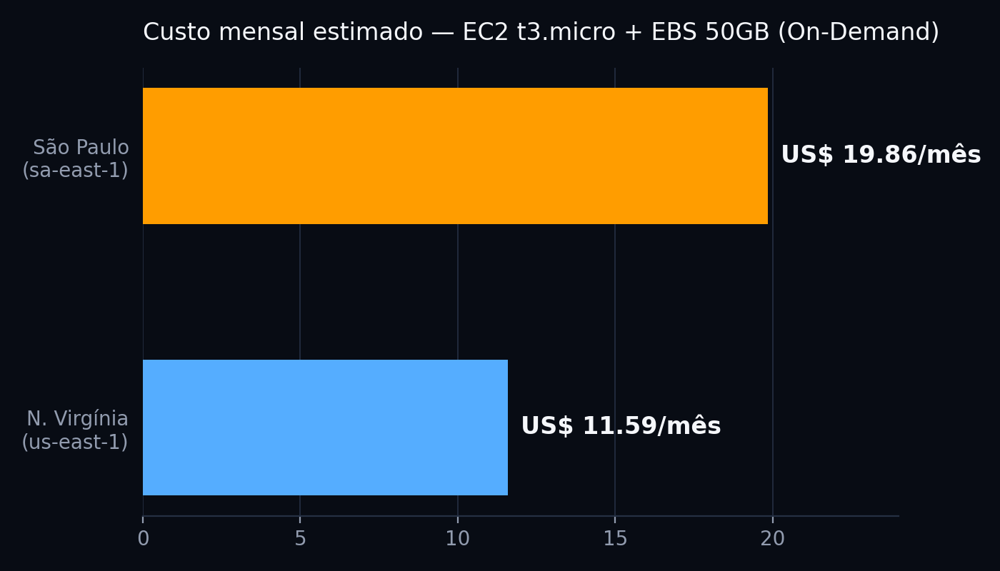
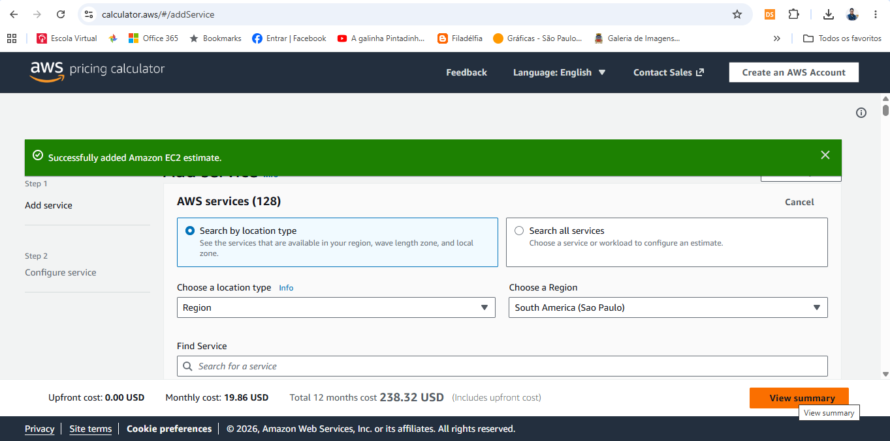
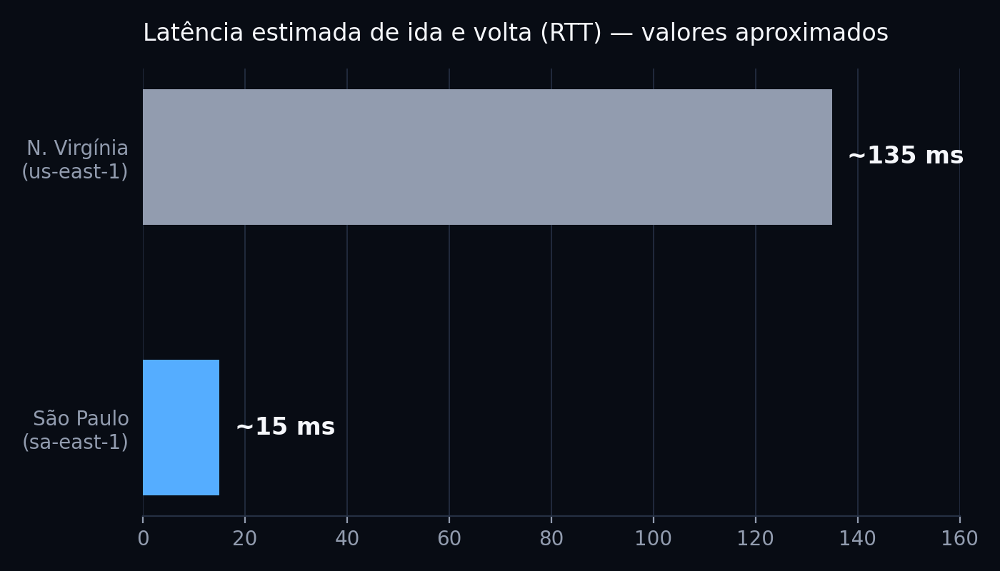

# 🌱 FarmTech Solutions — Sistema de Irrigação Inteligente


## Visão geral

O **FarmTech Solutions** é um projeto acadêmico desenvolvido em grupo ao longo das fases 2, 3 e 4 da disciplina de Inteligência Artificial da FIAP. A proposta simula um ecossistema agrícola inteligente para lavoura de café, integrando **ESP32**, **Wokwi**, **Python**, **Oracle**, **Streamlit** e **Machine Learning**.

Nesta etapa final, o projeto evolui para uma abordagem de **previsão inteligente na agricultura**, com dashboards analíticos, ingestão automatizada de dados, modelos de regressão e recomendações baseadas em dados.

## Sumário

- [Entrega 1 — Machine Learning](#entrega-1--machine-learning)
- [Entrega 2 — Computação em Nuvem](#entrega-2--computação-em-nuvem)
  - [Contexto](#contexto)
  - [Requisitos da atividade](#requisitos-da-atividade)
  - [Comparação de custos (AWS Pricing Calculator)](#comparação-de-custos-aws-pricing-calculator)
  - [Latência](#latência)
  - [Arquitetura](#arquitetura)
  - [Integração com a Entrega 1](#integração-com-a-entrega-1)
  - [LGPD e restrição de armazenamento no exterior](#lgpd-e-restrição-de-armazenamento-no-exterior)
  - [Matriz de decisão](#matriz-de-decisão)
  - [Decisão final](#decisão-final)
- [Apresentação visual complementar](#apresentação-visual-complementar)
- [Referências](#referências)

## Integrantes

| Nome           |
| -------------- |
| Thiese Novaes | 572659 |
| João Vitor | 572969 |
| Talles Duran | 572772 |
| Kevin Santiago | 573808 |
| Renan Souza | 568958 |

## Resumo do projeto

O projeto começa com a simulação de sensores em um **ESP32** no Wokwi, passa pela integração com dados climáticos via **OpenWeather**, avança para o armazenamento dos dados em **Oracle** e culmina em uma camada de análise com **Streamlit** e **Machine Learning**.

A cultura escolhida foi o **café**, por ser relevante para o agronegócio brasileiro e permitir a aplicação de regras agronômicas ligadas a umidade, pH e NPK. (revisar)

## Entregas da Fase 4

### Parte principal da atividade

- Pipeline de Machine Learning com regressão usando Scikit-Learn (revisar)
- Integração das previsões com o dashboard em Streamlit
- Exibição de métricas, previsões e gráficos analíticos

### Ir Além 1

- Ingestão automática de dados IoT no banco Oracle (revisar)
- População inicial do histórico
- Atualização automática das leituras

### Ir Além 2

- Dashboard analítico com tendências de produtividade (revisar)
- Comparação de rendimento real vs previsto
- Correlação entre NPK e rendimento
- Indicador de tendência do rendimento

## Vídeos demonstrativos

> 📌 A entrega principal da Fase 4 está documentada no vídeo "Parte 1 e Parte 2 (Entrega Final)". Os vídeos Ir Além 1 e Ir Além 2 apresentam funcionalidades complementares desenvolvidas além dos requisitos obrigatórios. (revisar)

| Entrega                                    | Link                                                               |
| ------------------------------------------ | ------------------------------------------------------------------ |
| Fase 2 — ESP32 + Wokwi                     | [Assistir no YouTube](https://www.youtube.com/watch?v=OxzF6pPU_3E) |
| Fase 3 — Banco de dados                    | [Assistir no YouTube](https://youtu.be/jpHLyaU5JCU)                |
| Fase 3.1 — Dashboard e ML                  | [Assistir no YouTube](https://youtu.be/x8uJeT7SODM)                |
| Fase 4 — Ir Além 1                         | [Assistir no YouTube](https://youtu.be/MsFykLMK8zw)                |
| Fase 4 — Ir Além 2                         | [Assistir no YouTube](https://youtu.be/Y9oP9D3x01s)                |
| Fase 4 — Parte 1 e Parte 2 (Entrega Final) | [Assistir no YouTube](SEU_LINK_AQUI)                               |
(revisar)

## Como executar

## Entrega 1 — Machine Learning

> ⚠️ **Substituir este bloco** pelo conteúdo já desenvolvido pelo grupo na Entrega 1: análise exploratória do `crop_yield.csv`, clusterização/identificação de outliers, os cinco modelos preditivos de rendimento de safra (com métricas de avaliação) e os links do notebook Jupyter (`NomeCompleto_rmXXXXX_pbl_fase4.ipynb`) e do vídeo demonstrativo no YouTube.

---

## Entrega 2 — Computação em Nuvem

### Contexto

O problema desta entrega não é apenas hospedar a Machine Learning da Entrega 1 — é escolher **onde** essa operação vai acontecer. A infraestrutura precisa receber, armazenar e processar dados dos sensores da fazenda (200 hectares) com previsibilidade e baixa latência. Para isso, comparamos as regiões **São Paulo (sa-east-1)** e **N. Virgínia (us-east-1)** sob três critérios: custo, proximidade da operação e governança de dados.

### Requisitos da atividade

| Requisito | Configuração escolhida | Status |
|---|---|---|
| Região | São Paulo (sa-east-1) × N. Virgínia (us-east-1) | ✅ Atende |
| Sistema operacional | Linux | ✅ Atende |
| Modelo de cobrança | On-Demand — 100% | ✅ Atende |
| vCPU | 2 | ✅ Atende |
| Memória | 1 GiB | ✅ Atende |
| Rede | Até 5 Gbps | ✅ Atende |
| Instância | t3.micro | ✅ Atende |
| Armazenamento | 50 GB — Amazon EBS gp3 | ✅ Atende |

A **t3.micro** foi selecionada por atender simultaneamente aos requisitos mínimos de 2 vCPU, 1 GiB de RAM e até 5 Gbps de rede, conforme a especificação oficial da AWS para esse tipo de instância — sendo a menor configuração da família T3 que cumpre todos os critérios do enunciado ao mesmo tempo.

> **⚠️ Ressalva técnica:** a t3.micro é uma instância *burstable* (família T3), com créditos de CPU acumulados por hora e desempenho de baseline por vCPU. Ela atende aos requisitos mínimos desta atividade, mas seus recursos são limitados para cargas de Machine Learning mais intensivas. Em produção, a instância deverá ser redimensionada conforme os resultados de monitoramento e consumo.

### Comparação de custos (AWS Pricing Calculator)

| Região | Total mensal (AWS Pricing Calculator) |
|---|---|
| N. Virgínia (us-east-1) | **US$ 11,59** ✅ *(confirmado via print)* |
| São Paulo (sa-east-1) | **US$ 19,86** ✅ *(confirmado via print)* |
| **Diferença** | **US$ 8,27/mês** (São Paulo é ~71% mais cara) |



**Figura 1 — AWS Pricing Calculator: us-east-1**
``

**Figura 2 — AWS Pricing Calculator: sa-east-1**



Valores estimados utilizando a AWS Pricing Calculator, modelo On-Demand (100%), Linux/Unix, EC2 t3.micro e EBS gp3 de 50 GB. O valor de São Paulo foi confirmado diretamente na calculadora (US$ 19,86/mês); o de N. Virgínia o valor foi de US$ 11,59, mas a decisão não deve ser tomada apenas pelo menor preço.

### Latência

| Região | Latência estimada (RTT) |
|---|---|
| São Paulo (sa-east-1) | ~15 ms |
| N. Virgínia (us-east-1) | ~135 ms |



Para IoT agrícola, distância física vira tempo de resposta: cada leitura de sensor e cada decisão automatizada de irrigação depende de ida e volta rápida entre o campo e a API.

 **Os valores devem ser validados por testes de conectividade realizados a partir do ambiente onde os sensores estarão instalados** — não representam benchmark oficial da AWS.

### Arquitetura

```
Sensores (ESP32)
      │
      ▼
   Internet
      │
      ▼
AWS São Paulo (sa-east-1)
┌───────────────────────┐
│  EC2 t3.micro          │
│  API + Machine Learning│
└───────────┬────────────┘
            │
            ▼
     EBS gp3 · 50 GB
   (armazenamento persistente)
```

- **Baixa latência:** dados e processamento ficam próximos da operação agrícola.
- **Escalabilidade:** a base pode evoluir para serviços gerenciados, filas, bancos e analytics.
- **Observabilidade:** monitoramento e métricas podem ser incorporados conforme a solução cresce.
- **Segurança:** IAM, criptografia, logs, backups e segmentação devem acompanhar a evolução.

> **Sobre o armazenamento:** para uma instância EC2, o armazenamento persistente é provisionado como **Amazon EBS**, e não como um disco físico interno. Foi utilizado o volume **gp3**, de uso geral, com 50 GB — cobrado conforme a capacidade provisionada, com desempenho de baseline incluído.

### Integração com a Entrega 1

Os sensores definidos na Entrega 1 produzem as variáveis (precipitação, umidade, temperatura) utilizadas pela solução FarmTech. Nesta etapa, a infraestrutura AWS é responsável por receber esses dados por meio de uma API, armazená-los e disponibilizá-los para o processamento e execução dos modelos de Machine Learning.

```
Entrega 1               API                 Armazenamento         Modelos de ML
Sensores (ESP32)  ──▶  EC2 t3.micro   ──▶   EBS gp3 (50GB)  ──▶   Previsão de
precipitação,          São Paulo             persistência          rendimento
umidade, temp.         sa-east-1             dos dados             de safra
```

### LGPD e restrição de armazenamento no exterior

- **Minimização:** coletar somente dados necessários para as finalidades definidas no projeto.
- **Segurança:** aplicar controles de acesso, criptografia, monitoramento e gestão de incidentes.
- **Governança:** definir responsabilidades, retenção, finalidade e trilhas de auditoria.
- **Transferência internacional:** se houver transferência internacional de dados pessoais, é necessário observar a LGPD e os mecanismos regulamentados pela ANPD.

**Ponto de atenção:** hospedar na região brasileira não significa, isoladamente, que toda operação esteja livre de transferências internacionais. A análise deve considerar o fluxo efetivo dos dados e os serviços utilizados.

> **Justificativa objetiva:** considerando a premissa do enunciado de que existe restrição ao armazenamento de dados no exterior, a FarmTech escolhe a região **sa-east-1 (São Paulo)**, pois mantém a infraestrutura de armazenamento principal no Brasil e reduz a complexidade associada ao fluxo internacional de dados. A arquitetura deve ainda verificar se outros serviços utilizados realizam processamento ou transferência internacional.

### Matriz de decisão

| Critério | São Paulo | N. Virgínia |
|---|---|---|
| Custo | 63 | 90 |
| Latência | 92 | 35 |
| Operação local / governança | 95 | 45 |

*Matriz qualitativa para apoio à decisão acadêmica; não representa benchmark oficial da AWS.*

### Decisão final

## São Paulo (sa-east-1) — escolhido por necessidade, não por preço.

1. **IoT:** menor latência estimada para uma operação agrícola localizada no Brasil.
2. **Governança:** arquitetura local simplifica a análise de fluxo de dados, sem substituir os controles de LGPD.
3. **Custo consciente:** diferença de referência de **+ US$ 8,27/mês** — um custo adicional conhecido e justificado pelo contexto, não ignorado.

---

## Apresentação visual complementar

Este README é o entregável oficial da atividade. Como material de apoio, o grupo também desenvolveu uma apresentação visual em HTML com o mesmo conteúdo, disponível em [`FarmTech_FIAP_Calculadora_AWS_v2.html`](./FarmTech_FIAP_Calculadora_AWS_v2.html).

**Vídeo (Entrega 2):** *(inserir link do YouTube, não listado, demonstrando a comparação de recursos na calculadora AWS)*

---

## Referências

- AWS. *AWS Pricing Calculator* e documentação de preços de Amazon EC2 e Amazon EBS. Consulta de referência: ago/2026.
- BRASIL. Lei nº 13.709/2018 — Lei Geral de Proteção de Dados Pessoais (LGPD).
- ANPD. Resolução CD/ANPD nº 19, de 23 de agosto de 2024 — Regulamento de Transferência Internacional de Dados.

<p align="center">
  FarmTech Solutions © 2026 — FIAP Inteligência Artificial
</p>
