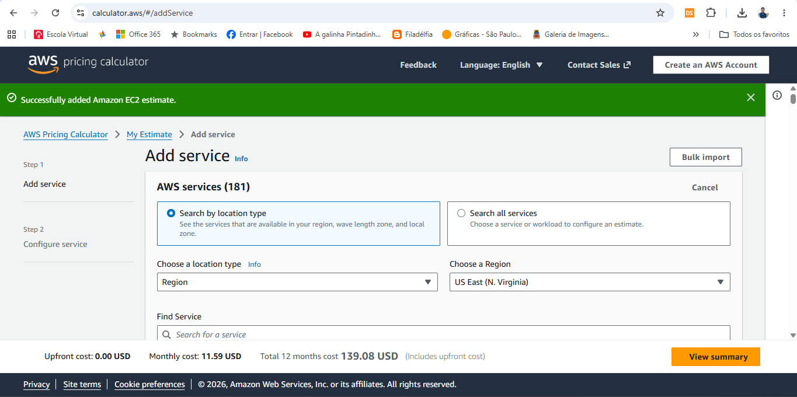
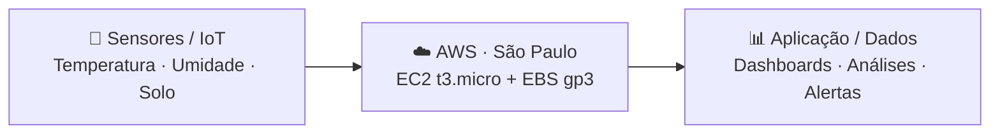
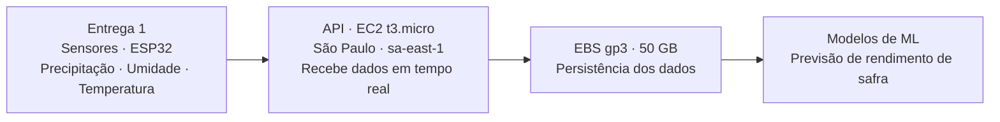

# ☁️ FarmTech Solutions na Nuvem

> **FIAP · Entrega Acadêmica · Cloud Computing**  
> Análise comparativa de infraestrutura AWS para uma fazenda inteligente, considerando custo, latência, disponibilidade arquitetural e proteção de dados.

| Item | Definição |
|---|---|
| **Projeto** | Entrega 2 — Cloud |
| **Arquitetura** | EC2 + EBS · On-Demand |
| **Regiões** | `sa-east-1` × `us-east-1` |
| **Referência** | Agosto/2026 |

### Integrantes

| Integrante | RM |
|---|---:|
| Thiese Novaes | RM572659 |
| João Vitor | RM572969 |
| Talles Duran | RM572772 |
| Kevin Santiago | RM573808 |
| Renan Souza | RM568958 |

---

## 01 · Contexto

### O problema não é apenas hospedar. É escolher onde a operação vai acontecer.

| Etapa | Descrição |
|---|---|
| 🌱 **IoT agrícola** | Sensores coletam dados de solo, clima, umidade e condições de cultivo para apoiar decisões operacionais. |
| ⚙️ **Processamento** | A infraestrutura precisa receber, armazenar e processar dados com previsibilidade e baixa latência. |
| ☁️ **Decisão cloud** | Comparamos São Paulo e N. Virgínia sob três critérios: custo, proximidade da operação e governança. |

**Configuração analisada**

- **Instância:** `t3.micro` · 2 vCPU · 1 GiB
- **Storage:** 50 GB · EBS `gp3`
- **Modelo:** On-Demand · Linux

---

## 02 · Requisitos

### Cada exigência do enunciado, mapeada para uma escolha técnica.

| Requisito | Configuração escolhida | Status |
|---|---|---|
| Região | São Paulo (`sa-east-1`) × N. Virgínia (`us-east-1`) | ✅ Atende |
| Sistema operacional | Linux | ✅ Atende |
| Modelo de cobrança | On-Demand — 100% | ✅ Atende |
| vCPU | 2 | ✅ Atende |
| Memória | 1 GiB | ✅ Atende |
| Rede | Até 5 Gbps | ✅ Atende |
| Instância | `t3.micro` | ✅ Atende |
| Armazenamento | 50 GB — Amazon EBS `gp3` | ✅ Atende |

A `t3.micro` foi selecionada por atender simultaneamente aos requisitos mínimos de 2 vCPU, 1 GiB de RAM e até 5 Gbps de rede, conforme a especificação utilizada no projeto — sendo a menor configuração da família T3 que cumpre todos os critérios do enunciado ao mesmo tempo.

> [!WARNING]
> **Ressalva técnica:** a `t3.micro` é uma instância *burstable* (família T3), com créditos de CPU acumulados por hora e desempenho de baseline por vCPU. Ela atende aos requisitos mínimos desta atividade, mas seus recursos são limitados para cargas de Machine Learning mais intensivas. Em produção, a instância deverá ser redimensionada conforme os resultados de monitoramento e consumo.

---

## 03 · Custo

### A região mais barata não é automaticamente a melhor arquitetura.

| Região | Código | Estimativa mensal | Comparação |
|---|---|---:|---:|
| 🇺🇸 N. Virgínia | `us-east-1` | **US$ 11,59/mês** | ~42% menor que SP |
| 🇧🇷 São Paulo | `sa-east-1` | **US$ 19,86/mês** | ~71% maior que VA |

### Evidências da AWS Pricing Calculator

**Figura 1 — N. Virgínia (`us-east-1`)**

**Figura 2 — São Paulo (`sa-east-1`)**

> Valores estimados utilizando AWS Pricing Calculator, modelo On-Demand (100%), Linux/Unix, EC2 `t3.micro` e EBS `gp3` de 50 GB. A decisão não deve ser tomada apenas pelo menor preço.

---

## 04 · Latência

### Para IoT, distância vira tempo de resposta.

| Região | Latência aproximada |
|---|---:|
| 🇧🇷 São Paulo · `sa-east-1` | **~15 ms** |
| 🇺🇸 N. Virgínia · `us-east-1` | **~135 ms** |

As latências são aproximações para fins acadêmicos e podem variar conforme operadora, rota, congestionamento e arquitetura de rede.

> [!NOTE]
> Os valores devem ser validados por testes de conectividade realizados a partir do ambiente onde os sensores estarão instalados. Eles **não representam benchmark oficial da AWS**.

---

## 05 · Arquitetura

### Uma arquitetura simples, próxima e preparada para crescer.

### Características

| Característica | Objetivo |
|---|---|
| ⚡ **Baixa latência** | Dados e processamento ficam próximos da operação agrícola. |
| 📈 **Escalabilidade** | A base pode evoluir para serviços gerenciados, filas, bancos e analytics. |
| 🔎 **Observabilidade** | Monitoramento e métricas podem ser incorporados conforme a solução cresce. |
| 🔐 **Segurança** | IAM, criptografia, logs, backups e segmentação devem acompanhar a evolução. |

> [!IMPORTANT]
> **Sobre o armazenamento:** para uma instância EC2, o armazenamento persistente é provisionado como Amazon EBS, e não como um disco físico interno. Foi utilizado o volume `gp3`, de uso geral, com 50 GB — cobrado conforme a capacidade provisionada, com desempenho de baseline incluído.

---

## 06 · Integração com a Entrega 1

### Os sensores da Entrega 1 alimentam a arquitetura desta etapa.

Os sensores definidos na Entrega 1 produzem as variáveis de **precipitação, umidade e temperatura** utilizadas pela solução FarmTech. Nesta etapa, a infraestrutura AWS é responsável por receber esses dados por meio de uma API, armazená-los e disponibilizá-los para processamento e execução dos modelos de Machine Learning.

---

## 07 · LGPD & Governança

### São Paulo reduz complexidade operacional — mas não elimina obrigações de proteção de dados.

| Princípio | Aplicação |
|---|---|
| **01 · Minimização** | Coletar somente dados necessários para as finalidades definidas no projeto. |
| **02 · Segurança** | Aplicar controles de acesso, criptografia, monitoramento e gestão de incidentes. |
| **03 · Governança** | Definir responsabilidades, retenção, finalidade e trilhas de auditoria. |
| **04 · Transferência internacional** | Se houver transferência internacional de dados pessoais, observar a LGPD e os mecanismos regulamentados pela ANPD. |

> [!NOTE]
> Hospedar na região brasileira não significa, isoladamente, que toda operação esteja livre de transferências internacionais. A análise deve considerar o fluxo efetivo dos dados e os serviços utilizados.

### Justificativa objetiva

Considerando a premissa do enunciado de que existe restrição ao armazenamento de dados no exterior, a FarmTech escolhe a região **`sa-east-1` (São Paulo)**, pois mantém a infraestrutura de armazenamento principal no Brasil e reduz a complexidade associada ao fluxo internacional de dados.

A arquitetura deve ainda verificar se outros serviços utilizados realizam processamento ou transferência internacional.

---

## 08 · Matriz de decisão

### O custo favorece Virgínia. A operação favorece São Paulo.

| Critério | São Paulo | N. Virgínia |
|---|---:|---:|
| 💰 Custo | 63/100 | **90/100** |
| ⚡ Latência | **92/100** | 35/100 |
| 🇧🇷 Operação local | **95/100** | 45/100 |

> Matriz qualitativa para apoio à decisão acadêmica; não representa benchmark oficial da AWS.

---

# 🏆 Decisão Final: São Paulo

## `sa-east-1` — escolhido por necessidade, não por preço.

| Critério | Justificativa |
|---|---|
| 🌱 **IoT** | Menor latência estimada para uma operação agrícola localizada no Brasil. |
| 🛡️ **Governança** | Arquitetura local simplifica a análise de fluxo de dados, sem substituir os controles de LGPD. |
| 💵 **Custo consciente** | Diferença de referência: **+ US$ 8,27/mês**. O custo adicional é conhecido e justificado pelo contexto. |

---

## 📚 Referências

- **AWS** — AWS Pricing Calculator e documentação de preços de Amazon EC2 e Amazon EBS. Consulta de referência: ago/2026.
- **BRASIL** — Lei nº 13.709/2018 — Lei Geral de Proteção de Dados Pessoais (LGPD).
- **ANPD** — Resolução CD/ANPD nº 19, de 23 de agosto de 2024 — Regulamento de Transferência Internacional de Dados.

---

**Apresentação acadêmica · FIAP · FarmTech Solutions · 2026**

> Este material complementa o `README.md` do repositório. O conteúdo completo, incluindo tabelas, prints da AWS Pricing Calculator e justificativas, também está documentado no README, conforme exigido pelo enunciado.